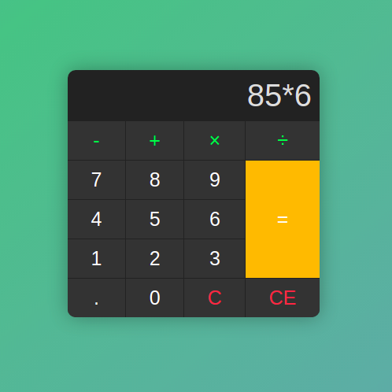
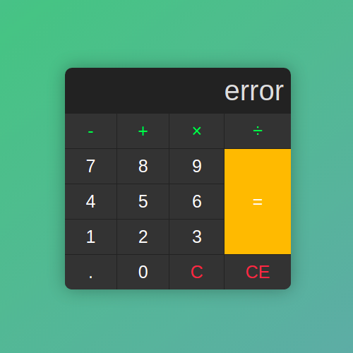

# Calcutator

Just a little calculator made with HTML, CSS and Javascript

Addition, subtraction, multiplication and division operations implemented. Clean button also implemented.

Made for a graduation discipline.

